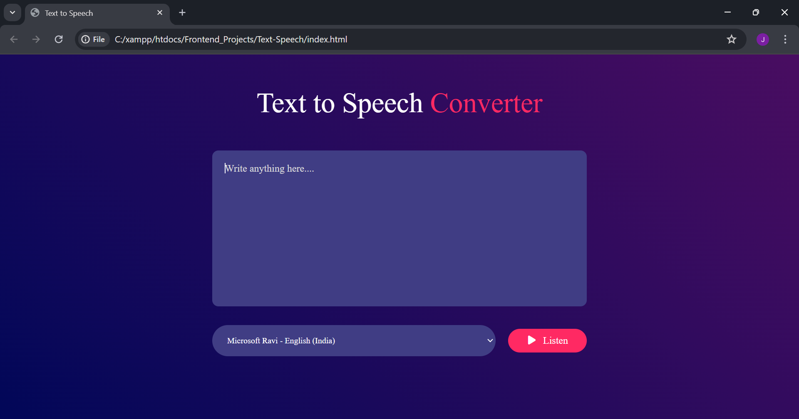

# Text-to-Speech Converter  

A **Text-to-Speech Converter** built using **HTML**, **CSS**, and **JavaScript**. This project uses the **Web Speech API** to convert text into spoken words and allows users to **choose from multiple voices** for a personalized experience. Perfect for beginners to learn **JavaScript**, **DOM manipulation**, and **browser APIs**.

## Live Demo  
🔗 **[Click here to try the project](https://jasnafathim.github.io/Text-to-Speech/)**  

## Screenshot  

## Features  
- Converts **text into speech** using Web Speech API  
- Clean and **responsive UI** with custom styling  
- Supports **multiple voice options**  
- Dropdown menu for **voice selection**  
- Real-time interaction using **event listeners**  
- Beginner-friendly and easy to customize  

## Tech Stack  
- **HTML5**  
- **CSS3**   
- **JavaScript (ES6)**   
- **Web Speech API**   

## How It Works  
1. Users type text in the **input box**  
2. Select a **preferred voice** from the dropdown  
3. Click the **Listen** button to hear the text  
4. The **Web Speech API** converts text to audio instantly

## Key Learnings
- Usage of Web Speech API for voice synthesis
- Creating custom UI elements
- Populating voices dynamically
- Handling event-driven JavaScript
- Integrating multimedia features without external libraries  

## Summary  
This Text-to-Speech Converter is a beginner-friendly JavaScript project. It demonstrates real-world browser APIs and improves your understanding of DOM manipulation, events, and multimedia integration.

## Connect with Me
- 
- 
- 
